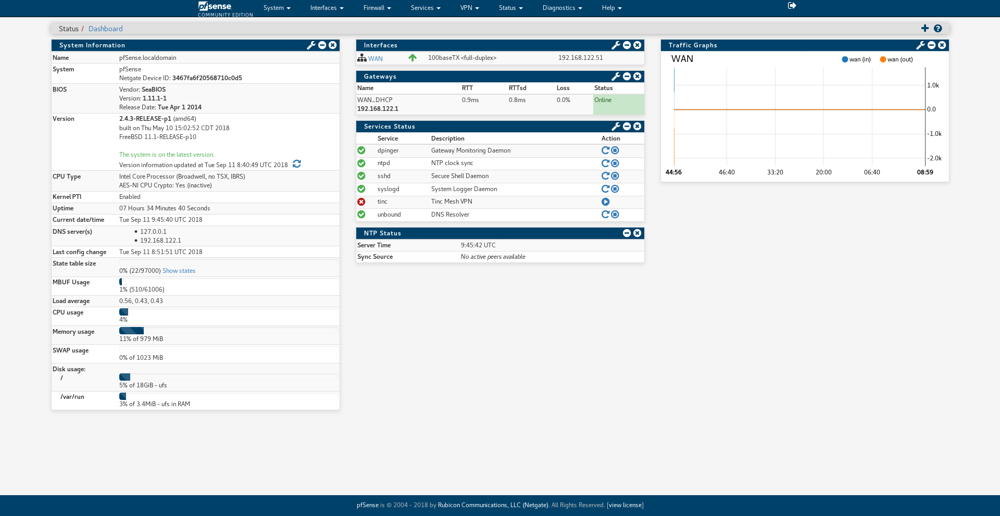

A blue version of [pfSense](https://github.com/pfsense/pfsense) compact red theme with a few minor fixes and adjustments.
## Screenshots

## To install
1. In Diagnostics -> Command Prompt, run `curl https://raw.githubusercontent.com/itworks99/pfsense-compact-blue/master/Compact-BLUE.css -o /usr/local/www/css/Compact-BLUE.css`
2. At pfSense settings, go to System -> General Setup then choose Compact-BLUE at webConfigurator section. Press 'Save' at the bottom of the page then navigate to the main page.
